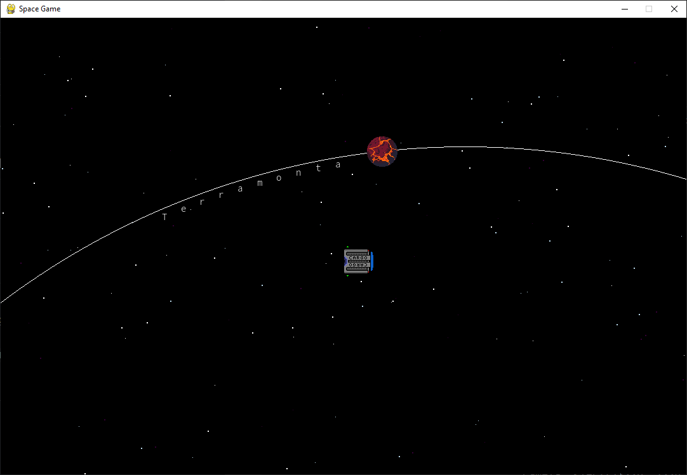
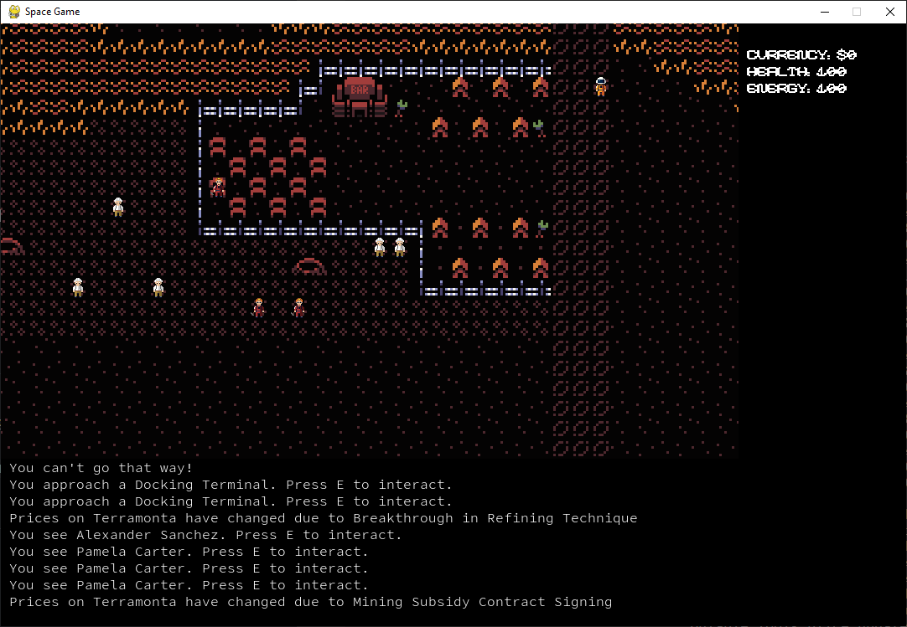
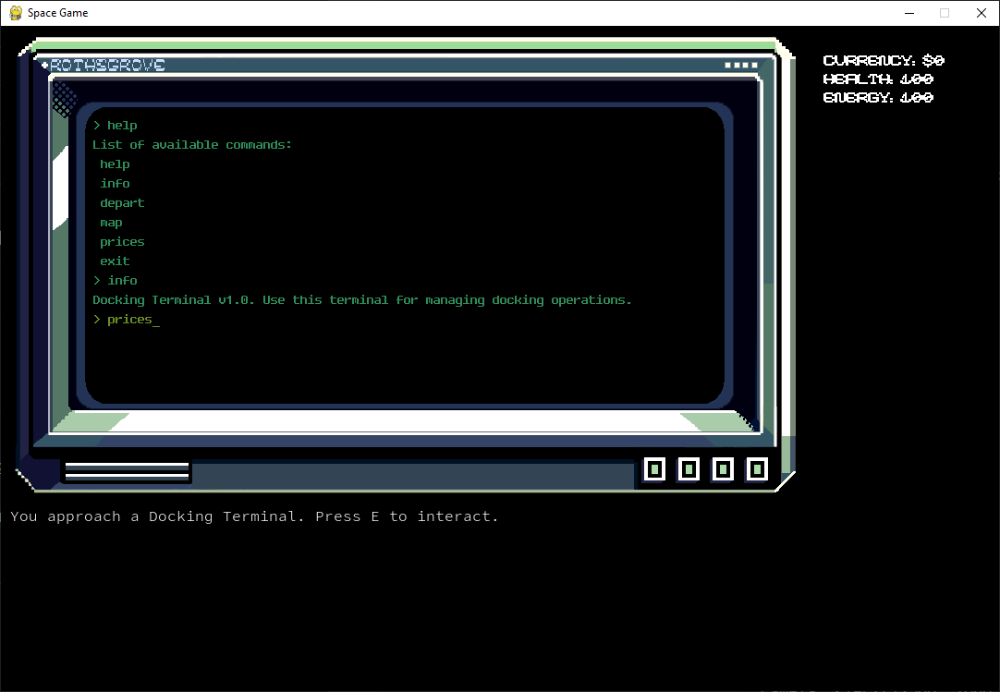

# Space Trader Roguelike

A work-in-progress 2D open universe space trading roguelike game where you explore procedurally generated star systems, trade commodities between stations, upgrade your ship, and try to survive in the vastness of space. One man project by Domenick Galati

## Current Features
- Basic ship movement and controls
- Procedurally generated universe with multiple star systems
- Random Market Adjustments

## Screenshots


*Fly around starsystems*


*Land on planets!*


*Trading interface at a space station*

## Work In Progress
This game is currently under active development. Planned features include:
- Enhanced trading and economy system
- Faction reputation system
- Quest and mission system
- Additional random events and encounters
- Turn Based combat mechanics
- Save/load game functionality
- Trading system between space stations
- Ship customization and upgrades
- Combat with space pirates and other hostile ships
- Resource management (fuel, cargo space, credits)

## How to Play
Currently in pre-alpha stage. More instructions will be added as development progresses.

## Run from source

Python 3.10+ required. From the repository root (the folder that contains this `readme.md` and the inner `space/` directory):

```bash
python -m venv .venv
.venv\Scripts\activate
pip install -e .
space-trader
```

On macOS/Linux, activate with `source .venv/bin/activate` instead.

If the `space-trader` command is not on your `PATH` (common with a fresh venv), use:

```bash
python -c "from main import main; main()"
```

The game resolves asset paths from the inner `space/` tree automatically; you still need the raster assets (for example `space/assets/img/` and fonts under `space/assets/fonts/`) present on disk for it to start—those files are not all tracked in this repository.
