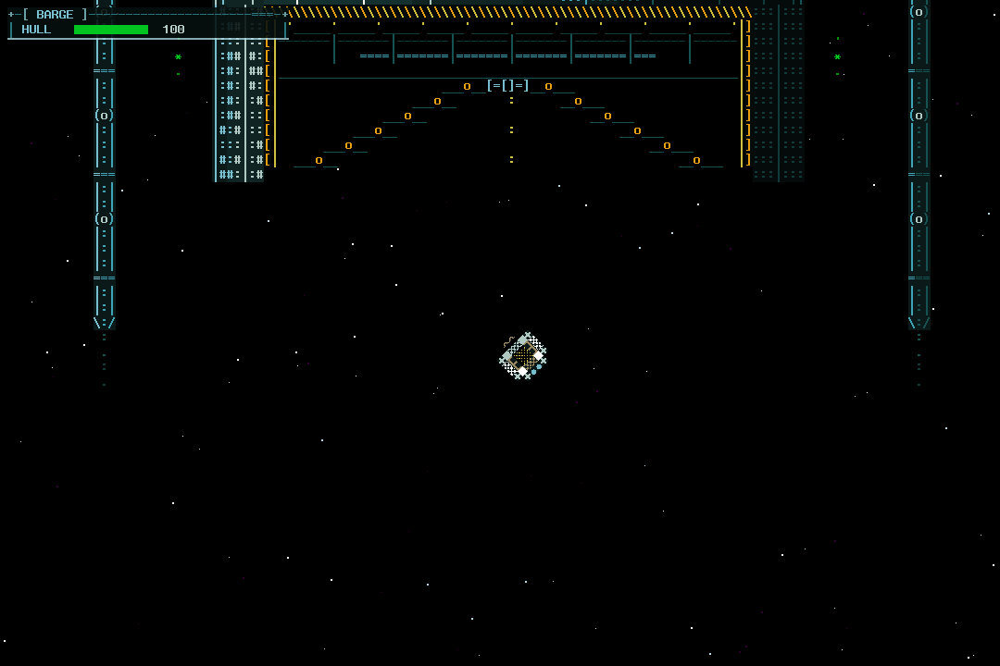
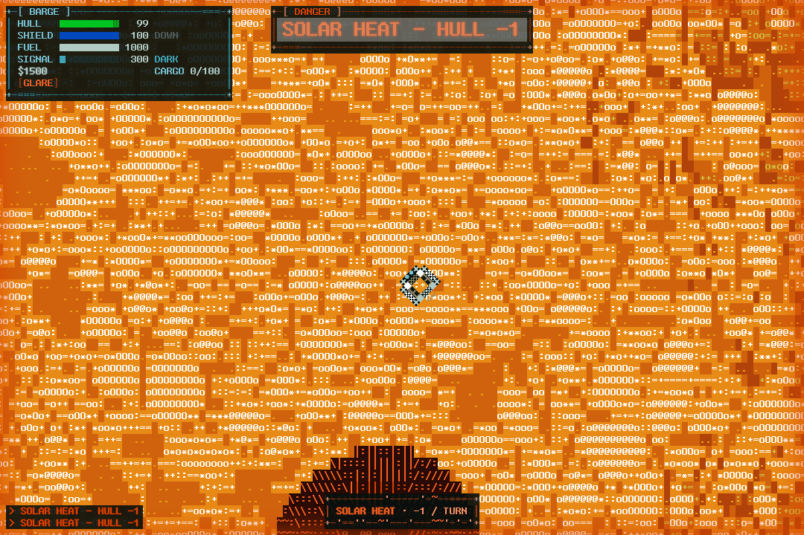
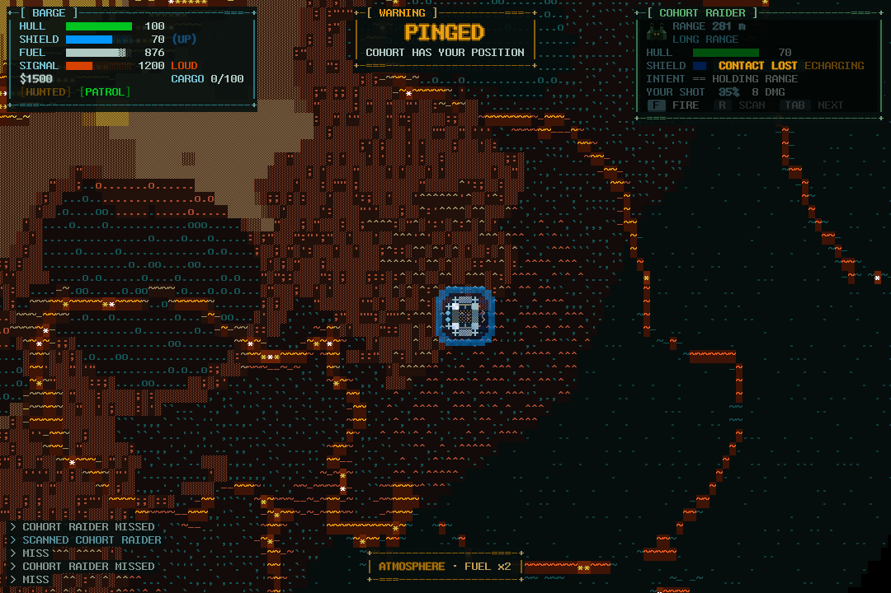
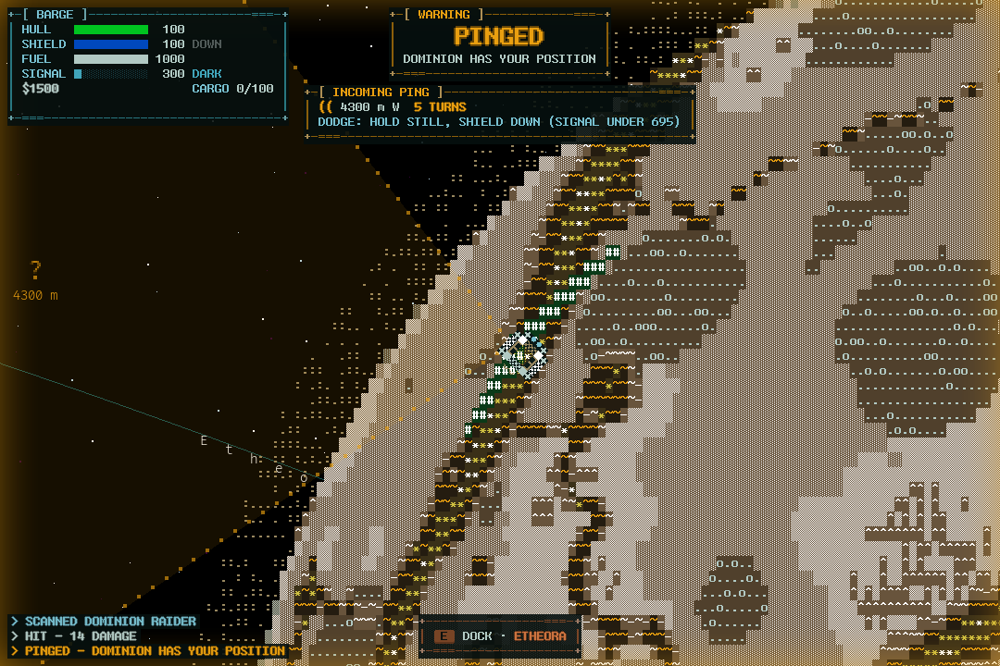
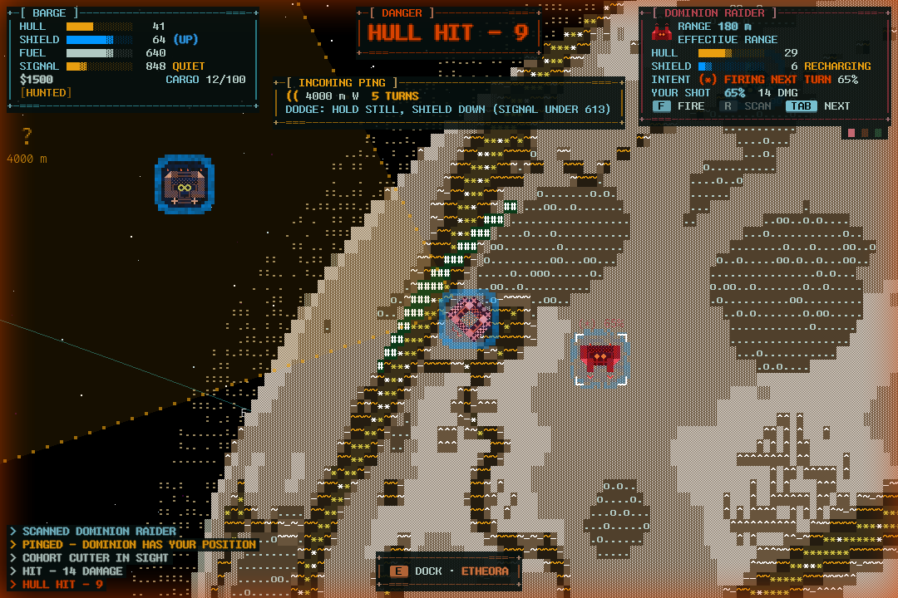
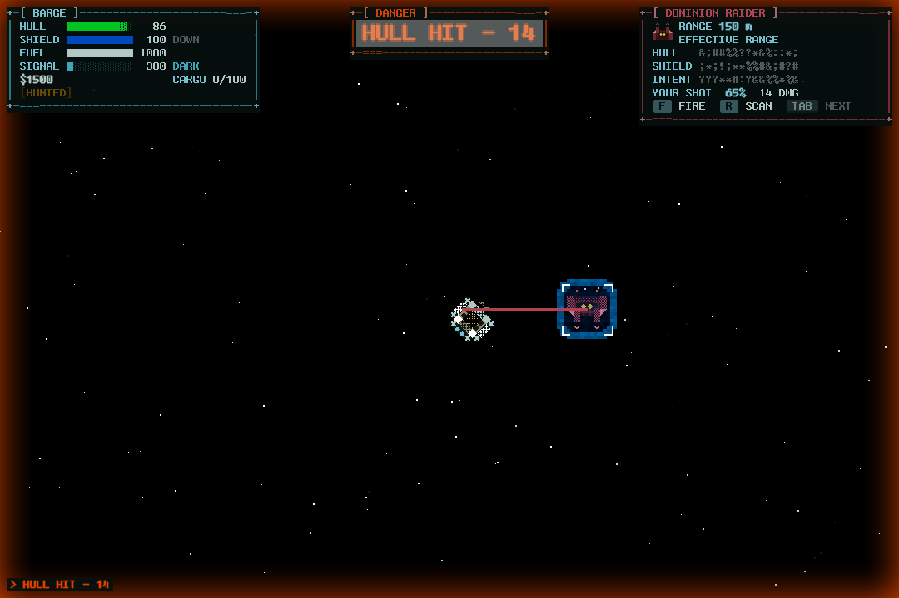
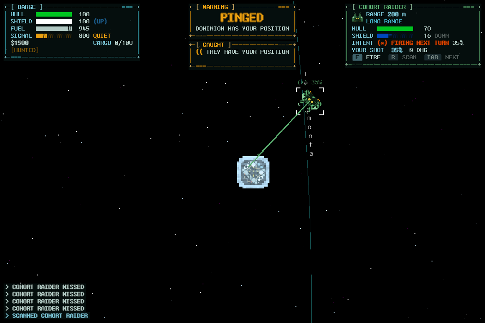
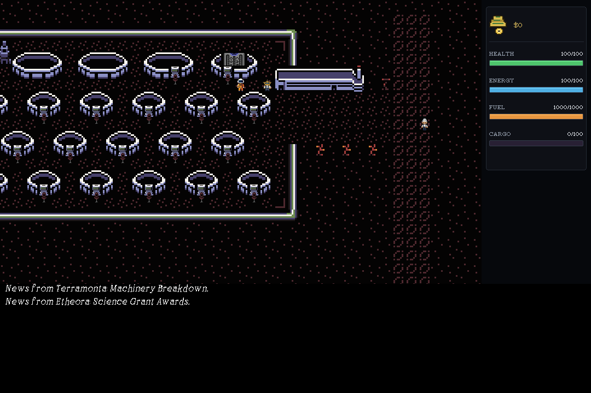

# Space Trader Roguelike

A 2D space trading game in Sol. You fly a barge on a turn clock, chart worlds, trade, and survive privateers licensed by the factions that hate the Assembly. Work in progress, by Domenick Galati.

A new run starts under the bay at **Nexum Astra**, the Assembly station, with $1500 and a full tank. The window is 1080×720, resizable, and keeps its shape when stretched. F11 toggles fullscreen.

## Flight

You leave the station into a glyph starfield: a painted sun, orbit lines, and worlds big enough to fill the screen.



*Under the bay at Nexum Astra.*

The sun has a glare. Deep enough in, sensors go blind and the hull takes heat each turn. The edges of the screen burn with it.



*Solar heat. The glare hides you, and it also hurts.*

Riding a charted orbit is cheap. Dropping into a world's atmosphere is not: fuel burn doubles, and the action strip says so. Terramonta (Assembly, industrial) and Etheora (Caravaneers, urban) are the worlds with surfaces you can walk. The other worlds in Sol can be pinged and scanned.



*Over Terramonta. Atmosphere burns fuel at twice the cruise rate.*

Pull into a world's approach corridor, or a wreck's, and the strip offers the next action. Dock, salvage, or scan, in that order.



*Etheora's corridor. Running dark, shield down, with a ping five turns out.*

## Fighting

Dominion, Cohort, and Caravaneers license privateers against Assembly shipping. They patrol, hunt off your pings, and engage on the same turn clock you do. A scan shows what they mean to do next, including a shot, a turn before they fire.

Shots come out of the shield. Range decides the hit chance and the damage: close, effective, or long. Raising the shield spends nothing and catches incoming fire; it also makes you loud, and it recharges slower than a shield left down.



*A Dominion raider over Etheora. Scanned, so the panel shows it firing next turn.*



*Shield down. The shot reaches the hull.*



*A Cohort raider at long range. The bracket is the target; F fires, R scans, Tab cycles.*

Destroy one and it leaves a wreck. Salvage what fits in the hold. Standing with its sponsor drops, and standing with the Assembly rises. Kills are remembered for bounties. If the hull fails, a tug hauls the barge back to the station and takes a cut of your credits.

Assembly worlds and Nexum Astra sit in patrol zones. Privateers break off there.

## On the ground

Dock and you are on foot. Walk the map, talk to people, and use the terminals. Prices move when you land, and the log carries news from the worlds you know.



*Terramonta. The sidebar is the body; the log is the market.*

The docking terminal trades, refuels, repairs, and departs. The ship computer, opened with E in flight, scans, hails, pings by name, and salvages.

## Keys

| | In flight | On a surface |
| --- | --- | --- |
| Move | Arrows or numpad. Numpad diagonals work. | Arrows or numpad, including diagonals. |
| Boost | Hold Shift. Half a turn per tile, twice the fuel. | |
| Wait | Space. One turn, and quieter than flying. | |
| Shield | S. Raised catches shots and shouts your position. | |
| Ping | P. Everyone in range hears it. | |
| Target | Tab cycles armed contacts you can sense. | |
| Fire / scan | F fires. R scans the target. | |
| Act | E, in a corridor: dock, salvage, or open the ship computer. | E to talk or use what you are standing at. |
| Fullscreen | F11 | F11 |

On the docking terminal: `help`, `prices`, `buy`, `sell`, `cargo`, `news`, `refuel`, `repair`, `depart`, `exit`.

An empty tank still flies. Each tile takes two turns.

## Run from source

Python 3.10+ required. From the repository root (the folder that contains this `readme.md` and the inner `space/` directory):

```bash
python -m venv .venv
.venv\Scripts\activate
pip install -e .
space-trader
```

On macOS/Linux, activate with `source .venv/bin/activate` instead.

If `space-trader` is not on your `PATH`, run it from `space/src`:

```bash
python -c "from main import main; main()"
```

Asset paths resolve from the inner `space/` tree, so the current working directory does not matter after install. The raster art under `space/assets/img/` and the fonts under `space/assets/fonts/` have to be on disk. They are not all tracked in this repository.

## Maps

Walkable maps are generated from a YAML spec:

```bash
python -m mapgen space/assets/maps/specs/<slug>.yaml --preview out.png
```

In Cursor, `/generate-map` runs the project skill at `.cursor/skills/generate-map/`. It asks for lore, layout, rooms, people, and economy before generating, and it refuses to overwrite a hand-made map such as Terramonta.

Surfaces in the tree today: Terramonta, Etheora, and Nexum Astra.

## Not in a run yet

Sol is the only system. There is no shipyard, no quest log, and no bounty desk. Kills change standing and sit in a log. Save and load helpers exist for tests; starting the game begins a fresh run and does not write a slot.
