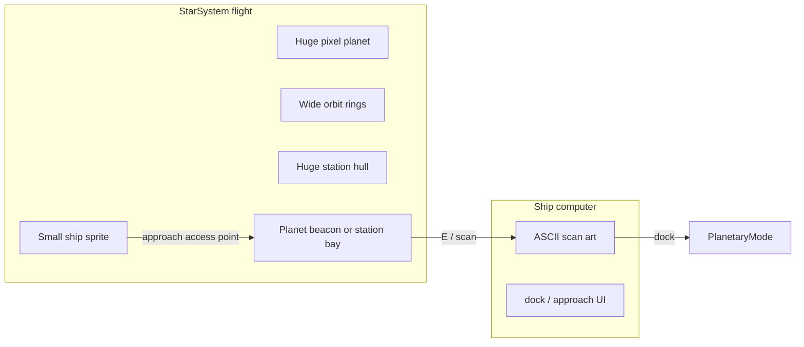

# Space Mode: Scale, Art, and Docking

## What’s broken today

In [`star_system_mode`](space/src/modes/star_system_mode/), the **ship is larger than the planets** (96×96 barge vs 48–64px planet PNGs). Orbits are only 500–1000px apart, docking is “overlap the whole body → scan → `dock`”, and fuel (~333 steps at 0.3/tile) barely bites because destinations are close and tiny.

You already have a strong split aesthetic:
- **Surface:** 24×24 pixel tiles + Cairopixel HUD
- **Ship computers:** green CRT + TeleSys + procedural ASCII in [`scan_art.py`](space/src/modes/star_system_mode/scan_art.py)

Space flight is the odd layer out. The redesign should fix scale *and* lean into that CRT/pixel language rather than invent a third style.

## Recommended art direction: hybrid “nav glass”

**Flight view:** chunky hi-res NES / limited-palette pixel art (hard nearest-neighbor). Planets read as massive painted disks; the ship is a small craft against them.

**Ship computers:** keep and deepen the Qud-like CRT/ASCII you already ship (scan, dock, hail). ASCII stays the *sensor* language, not the whole flight renderer.

Why this default: full ASCII flight would fight the MAS pixel surface mode; pure NES everywhere would waste the CRT scan work you already love. Hybrid matches the game’s identity: “pixel world / rail-roaded ship UI.”

Palette discipline for flight: ~16–32 colors, flat fills + 1px outlines, no soft gradients or bloom. Reuse CRT greens for nav HUD accents so modes feel related.

### Hard constraint: keep the hand-made starfield

**Do not modify** [`nightsky.py`](space/src/modes/star_system_mode/nightsky.py) or change the star background / parallax look and feel. That layer stays as-is regardless of planet/ship/orbit/dock work.

If camera math or draw order in [`input_handler.py`](space/src/modes/star_system_mode/input_handler.py) / [`star_system_mode.py`](space/src/modes/star_system_mode/star_system_mode.py) must change for scale, keep calling the existing nightsky API the same way so parallax behavior is unchanged. No re-tint, no density changes, no “NES-ify” the stars.

## Scale fantasy (the core feel)

Treat the system map as a **miniature solar system you crawl**, not icons on a chart.

| Element | Target feel | Shipped |
|---------|-------------|---------|
| Planet disk | Fills the screen when you are over it | **2304 px** images, disk radius 1072 (4× the first style A pass) |
| Station | A megastructure about the size of a planet | **2304 px** Nexum Astra, 450 px clear of the sun, bay faces south |
| Ship | Speck against a world or station | **48×48** frames on a 24 px collision tile |
| Orbit gaps | Real travel between worlds | **3200–4200 px** between rings, first ring past 5400 |
| Star | Visible gravity well / light source | **Sun.png** glyph disk, radius 1700, at map center |

Camera stays ship-centered (no continuous zoom at first). When you near a planet or station, it **grows into a structure you skim**, which sells “find the access point” without a separate zoom system.

Optional later: discrete zoom levels (system / approach) if the huge disks make distant navigation confusing — not required for v1.

## Docking as a spatial puzzle

Replace “collide with whole body AABB” with **named access points** on both planets and stations. Same gate for both; different geometry.

**Planets — rim dock beacons:**
1. 1–3 **dock beacons** (pixel markers / blinkers) at fixed angles on the circumference — e.g. Terramonta starport on the “dayside” arc.
2. Ship must enter a small **approach corridor** (e.g. 48–72 px around the beacon), not the whole planet disk.
3. Planet disk is **hazard or soft block**: skim the edge; deep atmosphere could slow or burn fuel faster (optional spice).

**Stations — access points (same idea, denser structure):**
1. Stations are **smaller than planets but still huge** — a megastructure you fly alongside, not an icon you bump.
2. 1–2 **access points** (airlock / docking bay / ring berth) on the hull silhouette — e.g. Nexum Astra bay on a specific arm or ring segment.
3. Whole station hull is **not** a dock target; only the access corridor is. Skimming the wrong face does nothing (or soft-bumps).
4. Station art should read as a built object with obvious “which side is the bay?” silhouette cues, not a tiny sprite.

**Shared gate (planets + stations):**
1. In corridor: `[E] Scan` / approach as today → CRT → `dock` if `.tmx` exists.
2. Uncharted / unscanned bodies: beacons and access points hidden until `scan` or a successful `ping` lock — reuse strong-lock distance in [`nav_charts.py`](space/src/modes/star_system_mode/nav_charts.py).

This makes both worlds and stations feel huge *and* gives the ship a job: fly the rim or hull, find the right point, commit fuel for the final approach.

## Fuel becomes meaningful (without being miserable)

Wider orbits alone help. Layer light systems on top:

- **Burn scales with intent:** cruise burn stays low; **boost** (optional hold-key) spends more for speed between rings.
- **Transfer budget:** a full tank should roughly cover **1–2 orbit hops** with margin, not a full grand tour — retune `FUEL_PER_STEP` / tank once orbit radii land.
- **Gravity assists / Hohmann flavor (light):** traveling *along* a charted orbit ring could be cheaper than radial cuts — rewards reading the rings instead of bee-lining.
- **Reserve thrusters** (already ×5 slow at 0 fuel) stay as the “you misjudged” punishment; refuel at dock remains the recovery.
- **Dock approach tax:** small fuel cost on successful `dock` so empty reserves can’t always limp into port for free.

Stations as mid-system fuel oasis (Nexum Astra already sits off-orbit) become strategically important once planets are far apart.

## Springboard ideas (beyond the ask)

1. **Terminator & light side:** planets show a lit/dark hemisphere from the sun; dock sites prefer dayside / station-side — cheap drama, helps wayfinding.
2. **Atmospheric skim:** entering the disk adds visual haze + higher burn; rewards precise rim flying.
3. **Beacon triangulation:** `ping` paints a gold arc (you already have candidate arcs); second ping from another angle narrows the dock longitude — turns charting into a mini-game.
4. **Moon / belt clutter:** tiny obstacles on the way to a dock site so “huge planet” isn’t just empty disk.
5. **Approach CRT overlay:** when in corridor, a thin TeleSys strip (“DOCK VECTOR LOCK 87%”) — same language as scan without opening the full terminal yet.
6. **Procedural planet faces from scan noise:** reuse [`scan_art.py`](space/src/modes/star_system_mode/scan_art.py) noise seeds to *paint* the big flight disks so scan ASCII and the world disk feel like the same body.
7. **Ship silhouette variants:** barge stays chunky NES; later fighters/tankers read instantly at 24–32px.

## Implementation spine (when you greenlight build)

Primary files (source of truth under `space/src`, not `build/lib`):

- [`star_systems.py`](space/src/modes/star_system_mode/star_systems.py) — orbit spacing, map size, sun draw, stop redrawing rings every frame onto a dirty `map_surface`
- [`planet.py`](space/src/entities/planet.py) / assets under `space/assets/img/planets/` — large disks + dock beacon data
- [`object.py`](space/src/entities/object.py) / [`space_station2.png`](space/assets/img/objects/space_station2.png) — huge station art + access-point data (smaller than planets, still skim-scale)
- [`star_system_mode.py`](space/src/modes/star_system_mode/star_system_mode.py) + [`input_handler.py`](space/src/modes/star_system_mode/input_handler.py) — approach corridor collision vs whole-body overlap; fuel retune (leave nightsky wiring alone)
- [`scan_terminal.py`](space/src/modes/star_system_mode/scan_terminal.py) / [`nav_charts.py`](space/src/modes/star_system_mode/nav_charts.py) — beacon reveal + dock gate
- [`player.py`](space/src/entities/player.py) — ship art scale + fuel constants
- Ship sheet [`barge6frame.png`](space/assets/img/barge6frame.png) — redraw or downscale pipeline to ~24–32px with nearest-neighbor
- **Leave alone:** [`nightsky.py`](space/src/modes/star_system_mode/nightsky.py)

**Phasing:** (1) scale + orbits + sun + smaller ship, (2) dock beacons + corridor gate, (3) fuel retune + nav reveal, (4) shared procedural face between flight disk and scan ASCII.

## Out of scope for first pass

- **Star background and parallax** — hand-authored; frozen for this redesign
- Continuous free zoom / 3D orbits
- Full ASCII replacement of flight view
- Reworking planetary tile art (already consistent enough)
- Perfect real orbital physics
